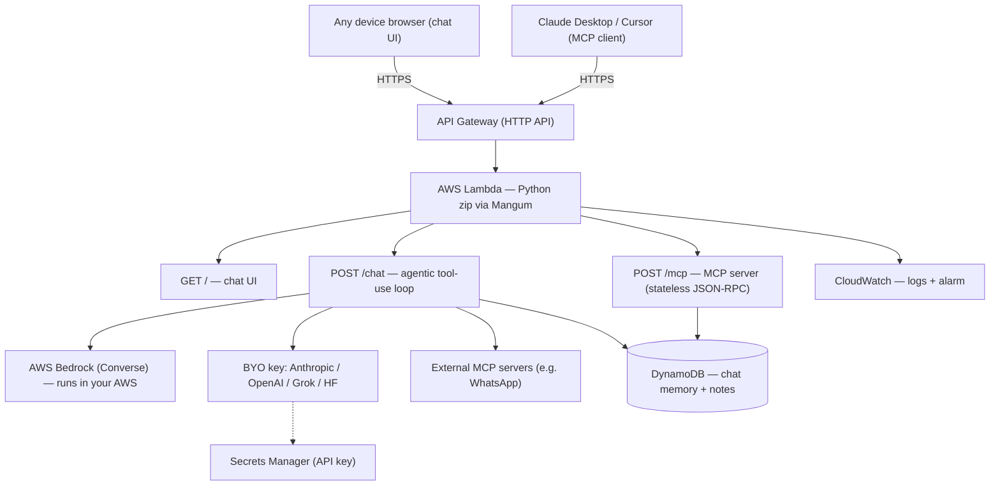

# Your Own Cloud AI Backend, Deployed to AWS in One Command (Terraform)

**The problem:** Running capable AI locally needs real hardware. If your laptop is modest, large
models are slow or impossible, and the usual fix is handing your data and your workflow to a
third-party SaaS. There's no easy middle ground: *your own* AI compute, in *your own* cloud, that any
device can reach.

**This repo fixes that.** One `terraform apply` stands up a private AI backend in **your** AWS account:
a chat/agent endpoint that offloads all the heavy inference to the cloud, so a weak laptop only needs a
browser. You pick where the compute comes from, **AWS Bedrock** (runs entirely in your AWS, no external
key) or **bring-your-own-key** (Anthropic / OpenAI / Grok / Hugging Face). Your conversations persist in
your own DynamoDB. Nothing is locked to a vendor; it's your infra, your keys, your data.

**Bonus:** the same deployment also exposes a **remote MCP server**, so you can plug your own tools into
Claude Desktop, Cursor, or Copilot.

Built as a focused project to learn Terraform / Infrastructure-as-Code by solving a real problem.

## What you get from one command
- **`/chat` endpoint** — send a message, get a reply from a cloud model. The heavy compute runs in AWS,
  not on your machine. Choose **Bedrock** or **bring-your-own-key** at deploy time.
- **Conversation memory** — threads are stored in your DynamoDB, keyed by `conversation_id`.
- **Remote MCP server (`/mcp`)** — example tools (`add_note`, `search_notes`) backed by DynamoDB;
  connect Claude/Cursor/Copilot to it.
- **A web chat UI** — open `ui_url`; a non-technical user just opens the page in any browser.

## Architecture



<sub>State is stored remotely (S3 backend + DynamoDB lock). GitHub renders the diagram above; it also appears as text in the raw file.</sub>

## Deploy it

Prereqs: an AWS account, **AWS CLI** configured (`aws configure`), **Python 3.12 + pip** (Terraform uses
it to vendor the Lambda dependencies, no Docker needed), Terraform >= 1.6.

```bash
# 1. One-time: create the remote-state bucket + lock table
cd bootstrap && terraform init && terraform apply && cd ..
# (put the bucket/table names into backend.tf if not already set)

# 2A. Deploy with AWS Bedrock (no external key). Enable model access in the Bedrock console first.
terraform init
terraform apply -var 'compute_backend=bedrock'

# 2B. …or bring your own key (example: Anthropic)
terraform apply \
  -var 'compute_backend=byok' -var 'llm_provider=anthropic' -var 'llm_model=claude-3-haiku-20240307'
# then set the key value WITHOUT putting it in Terraform state:
aws secretsmanager put-secret-value --secret-id mcp-on-aws-llm-key --secret-string 'sk-ant-...'

# 3. Use it from any device
terraform output chat_url
curl -s "$(terraform output -raw chat_url)" -H 'content-type: application/json' \
  -d '{"message":"Explain what this server does in one sentence."}'

# 4. (bonus) connect the MCP endpoint to Claude/Cursor
terraform output mcp_url

# 5. Tear it down
terraform destroy
```

Other providers in byok mode: `-var 'llm_provider=grok' -var 'llm_base_url=https://api.x.ai/v1'`, or
`openai` (default base URL), or a Hugging Face OpenAI-compatible endpoint via `llm_base_url`.

Cost note: Lambda, API Gateway, DynamoDB (on-demand), and CloudWatch stay near the AWS free tier for
light use. Bedrock and any BYO provider are pay-per-token. `terraform destroy` when done.

## Compute backends

| Backend | Where inference runs | Needs an external key? | Best for |
|---|---|---|---|
| `bedrock` | Your own AWS (Bedrock) | No | Simplest; everything in one cloud account |
| `byok` | The provider you choose | Yes (stored in Secrets Manager) | Using a specific model / your existing key |
| self-hosted GPU | Your own GPU instance | No | Full open-weights control *(optional, later stage, costly)* |

## Extending it: add your own tools / MCP servers

There are two ways to give the chat (and external MCP clients) new capabilities.

### Option 1, add a tool directly to this server (runs in your Lambda)
Best for simple tools. Edit `app/mcp_server.py`:

1. Add a tool spec to `MCP_TOOLS`:
   ```python
   {
     "name": "get_weather",
     "description": "Get the current weather for a city.",
     "inputSchema": {"type": "object", "properties": {"city": {"type": "string"}}, "required": ["city"]},
   }
   ```
2. Write the function it calls:
   ```python
   def _tool_get_weather(city):
       # ... your logic (call an API, read DynamoDB, etc.) ...
       return {"city": city, "tempC": 21}
   ```
3. Route it in `_run_tool`:
   ```python
   if name == "get_weather":
       return _tool_get_weather(args.get("city", ""))
   ```
4. `terraform apply`. The tool is now usable by the **chat** (it will call it automatically when relevant) *and* by any external MCP client connected to `/mcp`.

### Option 2, connect an external MCP server you run (e.g. a WhatsApp MCP)
Best when the tool is its own service. Your external server must speak stateless JSON-RPC
MCP over HTTP (`initialize`, `tools/list`, `tools/call`), exactly like this project's `/mcp`.

1. Deploy your MCP server somewhere with an HTTPS URL (another copy of this template works).
2. Create `terraform.tfvars` (gitignored, so tokens stay out of your repo):
   ```hcl
   compute_backend = "bedrock"
   external_mcp_servers = [
     { name = "whatsapp", url = "https://your-whatsapp-mcp.example.com/mcp", auth = "token-if-any" }
   ]
   ```
3. `terraform apply`. On the next chat, the agent discovers that server's tools, merges them
   with the local ones, and routes any calls to it, so you can say "text mom I'll be late" and
   the model calls your WhatsApp MCP. A down server is skipped (never breaks chat); local tools
   win on name clashes.

### How the chat uses tools
On the Bedrock backend the chat runs a **tool-use loop**: it sends all tools (local + external)
to the model; if the model asks for one, the app runs it (or forwards it to the external server),
feeds the result back, and repeats until the model answers. (BYO-key mode is plain chat for now.)

## What it demonstrates (for reviewers / interviews)
- **Terraform / IaC:** providers, resources, reusable **modules**, variables with validation, outputs,
  **remote state** (S3 + DynamoDB lock), and **conditional resources** (secret only in byok mode).
- **Serverless AWS:** Lambda (ZIP package, cross-platform wheels via pip `--platform`), API Gateway
  (HTTP API), DynamoDB, Secrets Manager, CloudWatch, Bedrock.
- **Security:** least-privilege IAM assembled with `concat` per mode (Bedrock or secret access only when
  that mode is on); API keys kept out of state via Secrets Manager.
- **AI depth:** a cloud chat/agent endpoint with pluggable compute, conversation memory, and a working
  remote MCP server.

## Tech
Terraform · AWS (Lambda, API Gateway, DynamoDB, Secrets Manager, Bedrock, IAM, CloudWatch) ·
Python · Mangum · MCP (Model Context Protocol)

## Repo layout
```
.
├── bootstrap/                 # one-time: S3 + DynamoDB for remote state
├── modules/
│   ├── storage/               # DynamoDB table (chat memory + MCP notes)
│   ├── lambda/                # IAM + Lambda (zip package) + log group + alarm
│   └── api/                   # API Gateway HTTP API + route + permission
├── app/
│   ├── mcp_server.py          # /chat agent + /mcp server + /health (+ Mangum handler)
│   ├── requirements.txt
│   └── Dockerfile             # optional: alternative container path (not used by the zip default)
├── versions.tf · providers.tf · backend.tf · variables.tf · main.tf · outputs.tf
└── .github/workflows/         # terraform CI (fmt / validate / py syntax)
```

## Status
- ✅ Remote state, storage, Lambda (ZIP, no Docker) + API Gateway → live endpoint
- ✅ `/chat` agent with **Bedrock or BYO-key** compute + DynamoDB conversation memory
- ✅ **Browser chat UI** served from the Lambda (open `ui_url`) — a weak laptop just needs this page
- ✅ Model-agnostic compute via the **Bedrock Converse API** (Claude / Nova / Llama by one variable)
- ✅ Remote **MCP server at `/mcp`** (stateless JSON-RPC, works on Lambda; no `mcp` library needed)
- ✅ **Agentic chat** (Bedrock): the chat calls your tools via a tool-use loop
- ✅ **External MCP clients**: point the chat at other MCP servers you run (e.g. a WhatsApp MCP) via `external_mcp_servers`
- ✅ GitHub Actions CI (fmt + validate + Python syntax on every push/PR)
- ⬜ Optional self-hosted GPU model (open-weights)

## What I learned
A few honest takeaways from building this:
- **IaC structure pays off.** Splitting into `storage` / `lambda` / `api` modules with remote state (S3 +
  DynamoDB lock) made the stack reproducible, one `terraform apply` rebuilds it identically in any account.
- **Conditional infrastructure.** Using `count` for the API-key secret and `concat` to assemble IAM
  statements per mode (Bedrock vs. BYO-key) keeps the policy least-privilege instead of over-granting.
- **Packaging without Docker.** I package the Lambda as a zip and vendor Linux wheels with pip's
  `--platform`/`--only-binary` flags, so it builds on macOS and runs on Lambda with no container step.
- **ASGI on Lambda has sharp edges.** Mangum adapts the web app to Lambda cleanly, but a long-lived MCP
  session manager can't run in Lambda's request/response model. I implemented the MCP server as a
  **stateless JSON-RPC handler** (initialize / tools/list / tools/call) instead, which works on Lambda and
  dropped the heavy `mcp` dependency entirely.
- **Bedrock realities.** Newer Claude models require a cross-region **inference profile** (`us.`-prefixed
  id), and Anthropic models need a one-time use-case form per account. Moving to the **Converse API** made
  the code model-agnostic, so swapping between Claude, Nova, or Llama is a one-variable change.
- **The core idea works:** a modest device just opens a web page, and all the inference runs in the cloud
  on infrastructure and keys you own.
